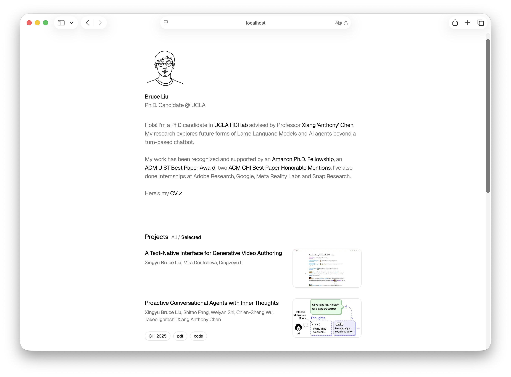

# Bruce's Personal Website



**<a href="https://liubruce.me" target="_blank">Live Demo →</a>**

A personal portfolio website showcasing research projects, publications, and professional information.

## Overview

This is a Next.js-based personal website designed for academics and researchers. It features a clean, modern interface to display your research work, publications, and professional profile.

Built on the [Nim: Minimalist Personal Site](https://vercel.com/templates/portfolio/nim-minimalist-personal-site) template, this project has been customized for academic portfolios with enhanced support for research publications and projects.

## Customization Guide

All personal content is centralized in `app/data.ts`. To customize the website for your own use:

### 1. Personal Information

Update your basic details:

```typescript
export const PERSONAL_INFO = {
  name: {
    english: 'Your Name',
    chinese: '你的名字', // Optional
  },
  title: 'Your Title @ Your Institution',
}

export const EMAIL = 'your.email@institution.edu'
export const SITE_URL = 'https://yourdomain.com'
```

### 2. Projects & Publications

Modify the `PROJECTS` array to list your research. Add project images to `public/img/projects/` and PDFs to `public/pdf/projects/`:

```typescript
{
  title: 'Your Project Title',
  authors: ['Author One', 'Author Two'],
  year: 2024,
  image: '/img/projects/yourproject.png', // Optional - place images in public/img/projects/
  award: 'Best Paper Award', // Optional - displays honors/awards
  selected: true, // Set true to feature this project prominently
  links: {
    // Common link types: conference name, pdf, code, blog, video, demo
    'Conference Name': 'https://doi.org/...',
    pdf: '/pdf/projects/yourpaper.pdf',
    code: 'https://github.com/you/repo',
    video: 'https://youtube.com/...',
  },
  id: 'unique-project-id',
}
```

### 3. Author Highlighting

Specify your name variants to be highlighted in author lists:

```typescript
export const HIGHLIGHTED_AUTHORS = ['Your Name', 'Your Full Name']
```

### 4. Blog Posts

Update the `BLOG_POSTS` array for blog content:

```typescript
{
  title: 'Your Blog Post Title',
  description: 'Brief description',
  link: '/blog/your-post-slug',
  uid: 'unique-blog-id',
}
```

### 5. Social Links

Customize your social media and professional profiles. Store your CV in `public/pdf/`:

```typescript
{
  label: 'Twitter',
  link: 'https://x.com/yourhandle',
  icon: 'Twitter', // Icon name from Lucide React
}
```

Available icons: `FileText`, `Twitter`, `Linkedin`, `GraduationCap`, `Github`, and more from [Lucide Icons](https://lucide.dev).

## Getting Started

```bash
# Install dependencies
npm install

# Run development server
npm run dev

# Build for production
npm run build
```

Visit `http://localhost:3000` to see your site.

## Project Structure

```
app/
├── data.ts          # All customizable content
├── page.tsx         # Main page component
├── layout.tsx       # Site layout
public/
├── img/projects/    # Project images
├── pdf/projects/    # Publication PDFs
└── pdf/             # CV and other documents
```

---

Built with [Next.js](https://nextjs.org) and [React](https://react.dev) • Based on [Nim](https://vercel.com/templates/portfolio/nim-minimalist-personal-site) template

